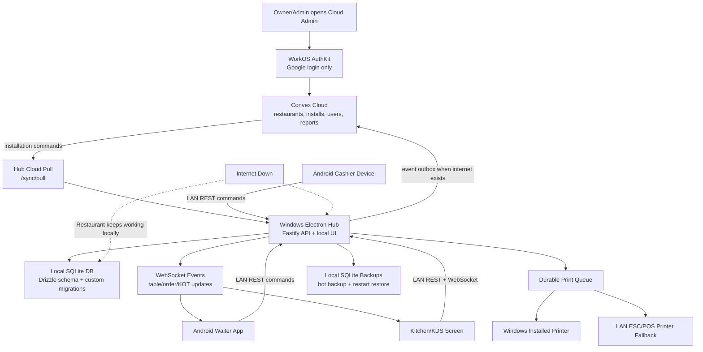
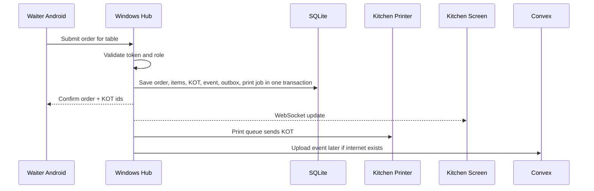
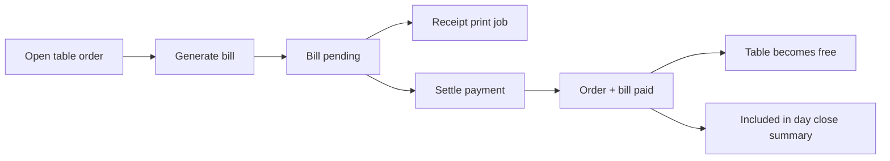

# POS Architecture Guide

This guide explains the current POS architecture in simple terms. The main idea is: the restaurant must keep working even when the internet is down.

## Big Picture

The system has three major areas:

- The Windows hub app inside the restaurant.
- Android devices used by waiters/cashiers/kitchen staff.
- Convex cloud used for account management, backup sync, and reporting.

The Windows hub is the most important part during service hours. Orders, KOTs, billing, table status, local device tokens, print jobs, and the SQLite database all live there.



## Why The Hub Exists

The hub is a local server running on the cashier/admin Windows PC.

It exists because the restaurant cannot depend on the internet. If Convex or the internet is down, the hub still accepts orders, creates KOTs, prints tickets, generates bills, and settles payments.

All other local devices talk to the hub over the restaurant LAN:

- Waiter Android app sends table orders.
- Kitchen screen reads KOTs.
- Cashier/admin UI manages billing, setup, printers, devices, backups, and sync.

The hub is the service-hour source of truth.

## Local Database

The hub uses SQLite. SQLite is stored only on the Windows hub machine.

Important rule: do not put the SQLite file on a shared network drive, and do not open it directly from Android devices or other PCs.

All devices access data through the hub API. That keeps writes controlled and avoids database corruption.

Current database approach:

- `apps/hub-electron/src/db/drizzle-schema.ts` defines the Drizzle ORM schema.
- `apps/hub-electron/src/db/schema.ts` still contains the custom SQL migration runner.
- `HubDatabase.orm` is the main database handle.
- Some dense `OrderService` internals still use prepared SQLite statements through Drizzle's owned SQLite client. That code is intentionally being converted slowly because KOT/billing transactions are high-risk.

## Local API

The hub exposes a Fastify REST API and WebSocket endpoint.

REST is used for commands:

- open/close POS day
- create floors/tables
- create/update menu items
- submit orders
- generate bills
- settle bills
- create pairing codes
- revoke devices
- create backups
- push/pull cloud sync

WebSocket is used for live updates:

- table status changed
- order submitted
- KOT status changed
- print or billing actions

## Auth Model

There are two auth layers.

Cloud auth:

- WorkOS AuthKit
- Google login only
- Used by the cloud admin app
- Owns restaurant account/admin identity

Local hub auth:

- Long-lived local device tokens
- Works offline
- Stored in the hub SQLite database as token hashes
- Created through pairing codes

This split is deliberate. Cloud auth can require internet. Restaurant service cannot.

## Device Pairing

The admin creates a pairing code from the hub UI.

The Android device enters that code. The hub then creates a local device token with a role:

- admin
- cashier
- waiter
- kitchen

After pairing, the device can keep working on LAN even if internet is down.

## Order And KOT Flow



The key rule is atomic local writing. When an order is finalized, the hub writes all important local records together:

- order state
- order items
- KOTs
- print jobs
- event log
- sync outbox

If a printer is offline, the order is still saved. The print job remains failed/pending and can be retried.

## Printer Routing

Menu items belong to production units.

Examples:

- Kitchen
- Bar
- Tandoor

Each production unit can have its own printer. A KOT is printed only to the printer for the production unit that owns those items.

The hub supports:

- Windows installed printers
- LAN ESC/POS printers as fallback

Bills use the receipt printer setting.

## Billing Flow



Current billing supports cash, UPI, and card payment methods at the data level. The UI currently focuses on cash settlement first.

Tax is currently a simple default GST calculation. Real GST/service charge rules still need the restaurant's final billing policy.

## Cloud Sync

Convex is not in the live order path.

Convex is used for:

- cloud admin login/session
- restaurant records
- installation identity
- synced local events
- reports
- cloud-to-hub command queue

The hub uploads local events through the sync outbox. If internet is down, events wait locally.

The hub also pulls commands from Convex:

- revoke device
- update device role/name/status
- create/update production units
- create/update/disable menu items
- update receipt printer settings

## Installation Identity

Each physical restaurant hub should have:

- `POS_INSTALLATION_ID`
- `POS_SYNC_SECRET`

Convex maps that installation id to a restaurant. This means the hub does not get to decide which restaurant it belongs to by sending a random restaurant id in each event.

That is safer for SaaS later.

## Backup And Restore

The hub can create hot SQLite backups while running.

Restore is scheduled, not applied immediately. On next app restart, the hub applies the selected backup before opening SQLite.

This is safer because replacing an active SQLite file while the app is running can corrupt data.

## Windows Packaging

The hub has Electron Builder config for a Windows NSIS installer.

Run this on a Windows machine or Windows CI:

```bash
pnpm --filter @gaurav-pos/hub-electron package:win
```

This cannot complete on macOS right now because `better-sqlite3` is a native module and cannot be cross-compiled to Windows by node-gyp from this Mac.

## What Still Needs Human/Hardware Input

These items need the actual restaurant environment:

- Test real PC-connected printers on the Windows hub machine.
- Confirm KOT routing with real kitchen/bar printers.
- Confirm bill printer output.
- Decide exact GST/service charge/rounding/discount rules.
- Run the Windows installer build on Windows hardware or CI.

Everything else should continue through normal code implementation and tests.

