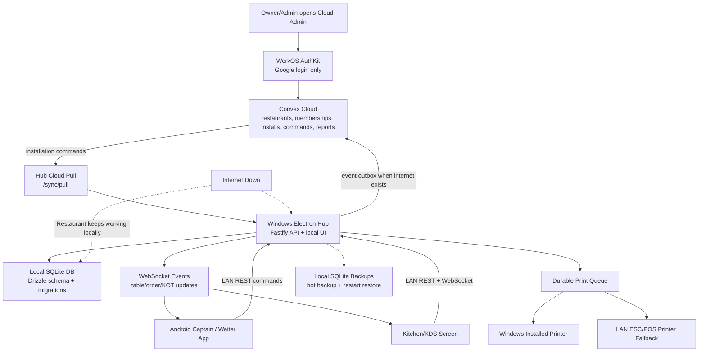
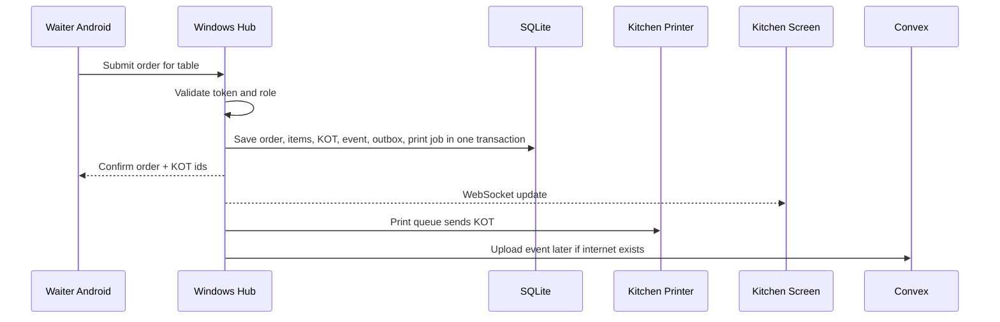

# POS Architecture Guide

This guide explains the current POS architecture in simple terms. The main idea is: the restaurant must keep working even when the internet is down.

## Big Picture

The system has three major areas:

- The Windows hub app inside the restaurant.
- Android devices used by captains, waiters, and kitchen staff.
- Convex cloud used for account management, event sync, command sync, and reporting.

The Windows hub is the most important part during service hours. Orders, KOTs, billing, table status, local device tokens, print jobs, and the SQLite database all live there.



## Why The Hub Exists

The hub is a local server running on the admin Windows PC.

It exists because the restaurant cannot depend on the internet. If Convex or the internet is down, the hub still accepts orders, creates KOTs, prints tickets, generates bills, and settles payments.

All other local devices talk to the hub over the restaurant LAN:

- Waiter Android app sends table orders.
- Kitchen screen reads KOTs.
- Admin hub UI manages setup, printers, devices, backups, and sync. Captain operations can run billing, payment, print, movement, and current-day reports.

The hub is the service-hour source of truth.

## Device-By-Device App Scope

Think of each app as one job, not one giant shared screen.

### 1. Windows Hub App

This runs on the admin PC. It is the local server, local database owner, printer owner, and main admin screen.

It has four main areas:

- Setup: automatic 6 AM IST business day, printers, floors/tables, kitchens/counters, menu, sale groups, manager PIN, device pairing, backups, and sync.
- Service: live table order entry, compact menu search, draft totals, editable table state, KOT-only submission, and Print and KOT submission.
- Kitchen: KOT/KDS status and print queue handling.
- Billing: bill generation, receipt reprint, discounts, tips, split payments, NC bills, and settlement.
- Reports: current business-day summary, finalized sale-group summaries, and local backup/report history.

If the internet is down, this app still runs the restaurant.

### 2. Android Captain / Waiter App

This is for the floor team. A paired `captain` device is trusted for table service and movement. A paired `waiter` device is more limited.

It does a smaller set of tasks:

- pair with the hub by QR/manual code
- show LAN connection status
- choose a table
- search menu items with shared Fuse.js fuzzy search across dish name, sale group, kitchen/counter, and variation labels
- use compact fuzzy search and sale-group tabs instead of recent/popular shortcuts
- add simple dish quantities
- review the KOT before sending
- save a draft if the hub is temporarily unreachable
- captain only: shift any running table to another free table
- captain only: shift selected items from any running table to another table
- captain only: generate-and-print bills, settle bills, and view current/older order history
- captain only: receive kitchen/bar ready alerts

It does not write directly to SQLite. It sends final orders to the hub.

### Current Role Authority

| Capability | admin | captain | waiter | kitchen |
| --- | --- | --- | --- | --- |
| Setup floors/tables/kitchens/dishes/printers/devices | yes | no | no | no |
| Submit orders | yes | yes | yes | no |
| View running table order | yes | yes | yes | no |
| See bill/payment/KOT details | yes | yes | no | no |
| Shift full table or selected items | yes | any running table/items | no | no |
| Generate, print, settle, revise, NC bills | yes | yes | no | no |
| Current reports/alcohol stock reports | yes | yes | no | no |
| KDS ticket status updates | yes | no | no | yes |

This means the Android app is role-aware: `captain` is the trusted operations role for table service, billing, current-day summary, and table/item shifting; `waiter` is basic order entry; `kitchen` is KDS only.

## Menu Simplicity

For now, a dish is deliberately simple:

- dish name
- price
- optional kitchen/counter
- active or inactive

The kitchen/counter is optional during setup. If a dish has no kitchen assigned, it can still be sold and billed, but it will not create a KOT until the owner assigns it to a kitchen/counter. Extra dish-customization catalogs are not part of the current product.

## Restaurant Workflow Rules

The current workflow is built around real restaurant operations:

- Use **Floor** everywhere, not room. Tables are shown by floor.
- Table colours mean: free is white, running is amber, and bill printed / pending payment is blue.
- Food, Alcohol, Beverage, and Other are sale groups. Each group can have its own tax lines and default kitchen/counter.
- Alcohol defaults to BOT, food/beverage defaults to KOT. A dish can override its kitchen/counter.
- Open items are allowed for off-menu sale entries. Captain chooses name, price, group, and optional print counter.
- Manager PIN is required for sensitive actions: cancelling an order, bill reprint/regeneration, revised bill changes, price edit, and NC bill.
- Captain movement is device-owned from the APK: a captain can shift only tables/items opened by that captain device. Admin can correct any valid table from the hub.
- Open items are stored as order snapshots, not hidden dishes, so setup stays clean.
- NC bills print like normal bills but do not count into sales, tax, or payment totals. Their item quantities still appear in usage/group summaries.
- The hub automatically finalizes old 6 AM IST business days and queues reports to Convex so the owner can review finalized days later.

### 3. Cloud Admin App

This is for owner/admin work when internet exists.

It does cloud setup and sync control:

- create the restaurant cloud record
- create the Windows hub connection without asking the owner to invent IDs or secrets
- invite staff by Google email and manage cloud roles
- queue advanced/support changes for menu, printer, kitchens/counters, and device revoke/update
- see connected hub health and recent synced events

It is not in the live restaurant order path.

## Local Database

The hub uses SQLite. SQLite is stored only on the Windows hub machine.

Important rule: do not put the SQLite file on a shared network drive, and do not open it directly from Android devices or other PCs.

All devices access data through the hub API. That keeps writes controlled and avoids database corruption.

Current database approach:

- `apps/hub-electron/src/db/drizzle-schema.ts` defines the Drizzle ORM schema.
- `apps/hub-electron/drizzle` contains the generated Drizzle migrations.
- `HubDatabase.orm` is the main database handle.
- Hub startup runs Drizzle migrations directly with `drizzle-orm/better-sqlite3/migrator`.
- The service-hour write path in `OrderService` uses Drizzle query APIs for business-day rows, order item diffs, KOT creation, billing, payments, print jobs, and event/outbox writes.

## Local API

The hub exposes a Fastify REST API and WebSocket endpoint.

REST is used for commands:

- get current business-day summary
- create floors/tables
- create/update menu items
- submit orders
- generate bills
- settle bills
- create pairing codes
- revoke devices
- create backups
- push/pull cloud sync

WebSocket is used for live updates:

- table status changed
- order submitted
- KOT status changed
- print or billing actions

## Auth Model

There are two auth layers.

Cloud auth:

- WorkOS AuthKit
- Google login only
- Used by the cloud admin app
- Owns restaurant account/admin identity

Local hub auth:

- Long-lived local device tokens
- Works offline
- Stored in the hub SQLite database as token hashes
- Created through pairing codes

This split is deliberate. Cloud auth can require internet. Restaurant service cannot.

## Device Pairing

The admin creates a pairing code from the hub UI after approving the action with the Manager PIN.

The hub shows both:

- a six-digit manual code
- a QR code containing the hub URL, pairing code, device name, role, and expiry

The Android device can scan the QR code with the camera, paste the QR payload manually, or enter the six-digit code. The hub then creates a local device token with a role:

- admin
- captain
- waiter
- kitchen

The phone never decides its own role. The role is stored on the one-time pairing code created by the Manager-PIN-approved hub screen.

After pairing, the device can keep working on LAN even if internet is down.

## Order And KOT Flow



On Android, the waiter reviews item quantities before sending the KOT so mistakes can be caught before kitchen printing starts.

The key rule is atomic local writing. When an order is finalized, the hub writes all important local records together:

- order state
- order items
- KOTs
- print jobs
- event log
- sync outbox

If a printer is offline, the order is still saved. The print job remains failed/pending and can be retried.

## Printer Routing

Menu items belong to kitchens/counters.

Examples:

- Kitchen
- Bar
- Tandoor

Internally the database calls these "production units," but the UI should say kitchen/counter. Each kitchen/counter can have its own printer. A KOT is printed only to the printer for the kitchen/counter that owns those items.

The hub supports:

- Windows installed printers
- LAN ESC/POS printers as fallback

Bills use the receipt printer setting.

## Billing Flow


Current billing supports manual captain-entered payments. This does not call any payment gateway. If the guest pays by UPI/card/online, the captain enters the method and amount after seeing the payment externally.

Supported settlement basics:

- full cash
- full UPI
- full card
- full online/manual external payment
- split payments, such as half cash and half UPI
- discount amount
- tip amount
- remaining balance tracking

The bill becomes paid only when total entered payments cover the final bill amount after discount and tip.

Tax is currently a simple default GST calculation. Real GST/service charge rules still need the restaurant's final billing policy.

The hub shows a current 6 AM IST business-day summary:

- cash sales
- UPI/card/online totals
- gross sales, discounts, tips, and final sales
- paid bills, unpaid bills, and open-order blockers

After the next 6 AM IST boundary, the hub automatically finalizes the old business day once old open/billed tables are settled or cancelled. No captain has to press an open-day or close-day button.

## Cloud Sync

Convex is not in the live order path.

Convex is used for:

- cloud admin login/session
- restaurant records
- restaurant memberships
- member invitations
- hub connection identity
- synced local events
- reports
- cloud-to-hub command queue

The hub uploads local events through the sync outbox. If internet is down, events wait locally.

The hub also pulls commands from Convex:

- revoke device
- update device role/name/status
- create/update kitchens/counters
- create/update/disable menu items
- update receipt printer settings

The cloud admin UI currently supports creating restaurants, owner-only hub connection creation, viewing sync health, inviting staff, and queueing advanced support commands. WorkOS/Convex auth is required for those actions.

## Hub Connection Identity

Each physical restaurant hub should have these values saved in the hub UI:

- hub connection / installation ID
- sync secret
- Convex cloud URL
- hub public LAN URL

Convex maps that internal hub id to a restaurant. This means the hub does not get to decide which restaurant it belongs to by sending a random restaurant id in each event.

That is safer for SaaS later.

Normal users should see this as "Connect the hub PC." Raw IDs, secrets, command payloads, and Convex terminology belong in Advanced/support screens only.

## Backup And Restore

The hub can create hot SQLite backups while running.

Restore is scheduled, not applied immediately. On next app restart, the hub applies the selected backup before opening SQLite.

This is safer because replacing an active SQLite file while the app is running can corrupt data.

## Windows Packaging

The hub has Electron Builder config for a Windows NSIS installer.

Run this on a Windows machine or Windows CI:

```bash
pnpm --filter @gaurav-pos/hub-electron package:win
```

This cannot complete on macOS right now because `better-sqlite3` is a native module and cannot be cross-compiled to Windows by node-gyp from this Mac.

## What Still Needs Human/Hardware Input

These items need the actual restaurant environment:

- Test real PC-connected printers on the Windows hub machine.
- Confirm KOT routing with real kitchen/bar printers.
- Confirm bill printer output.
- Decide exact GST/service charge/rounding/discount rules.
- Run the Windows installer build on Windows hardware or CI.

Everything else should continue through normal code implementation and tests.
