# Gaurav POS Flowcharts

This file contains Mermaid diagrams for the current POS system. It is meant to travel with `context.md`.

## 1. Complete System Map

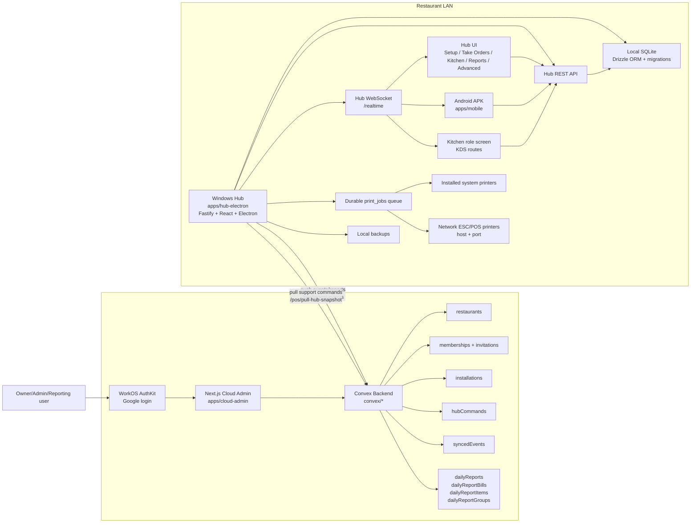

## 2. App Responsibilities

```mermaid
flowchart TD
  Root["Gaurav POS Monorepo"]

  Root --> HubApp["apps/hub-electron"]
  Root --> MobileApp["apps/mobile"]
  Root --> CloudApp["apps/cloud-admin"]
  Root --> ConvexApp["convex"]
  Root --> SharedPkg["packages/shared"]

  HubApp --> HubDb["SQLite owner"]
  HubApp --> HubApi["LAN REST + WebSocket"]
  HubApp --> HubOps["Setup, orders, KOT/BOT, billing, reports, backups"]
  HubApp --> HubPrinting["Printer queue + retry"]
  HubApp --> HubSync["Convex sync bridge"]

  MobileApp --> MobilePair["Connect + pair"]
  MobileApp --> MobileOrder["Pick table + send order"]
  MobileApp --> MobileCaptain["Captain table/item shift"]
  MobileApp --> MobileReady["Ready alerts polling"]

  CloudApp --> CloudAuth["WorkOS Google auth"]
  CloudApp --> CloudSetup["Restaurant + staff"]
  CloudApp --> CloudHub["Owner-only hub connection"]
  CloudApp --> CloudReports["Finalized business-day reports"]
  CloudApp --> CloudAdvanced["Advanced hub command queue"]

  ConvexApp --> ConvexSchema["Cloud schema"]
  ConvexApp --> ConvexAdmin["Admin queries/mutations"]
  ConvexApp --> ConvexSync["Event ingest + command pull"]

  SharedPkg --> SharedTypes["Roles/status/money/schemas"]
  SharedPkg --> SharedTable["Shared table display state"]
```

## 3. Auth And Pairing Flow

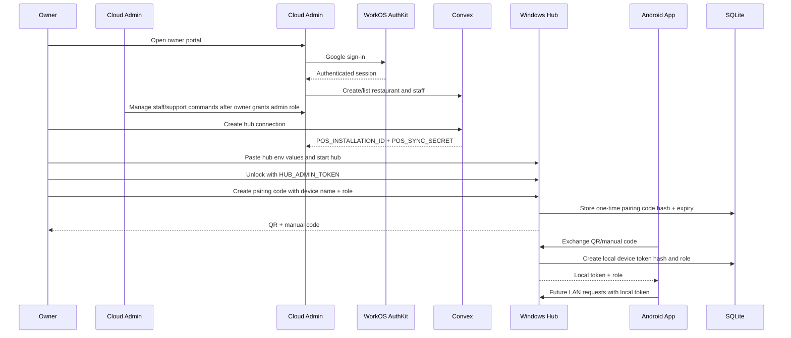

## 4. Role Permission Map

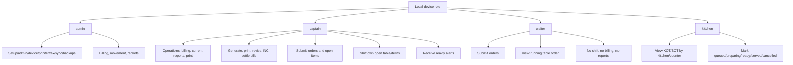

## 5. Daily Restaurant Operation

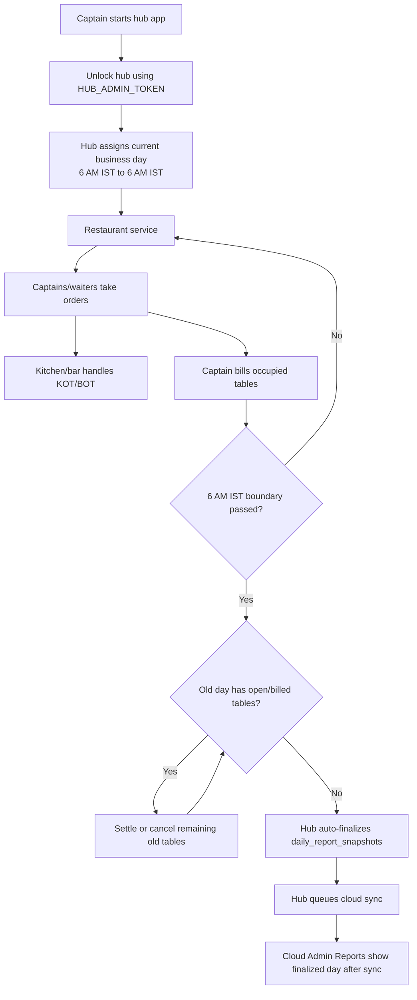

## 6. Setup Flow

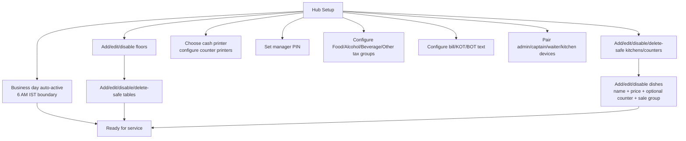

## 7. Order, KOT, BOT, And Printing Flow

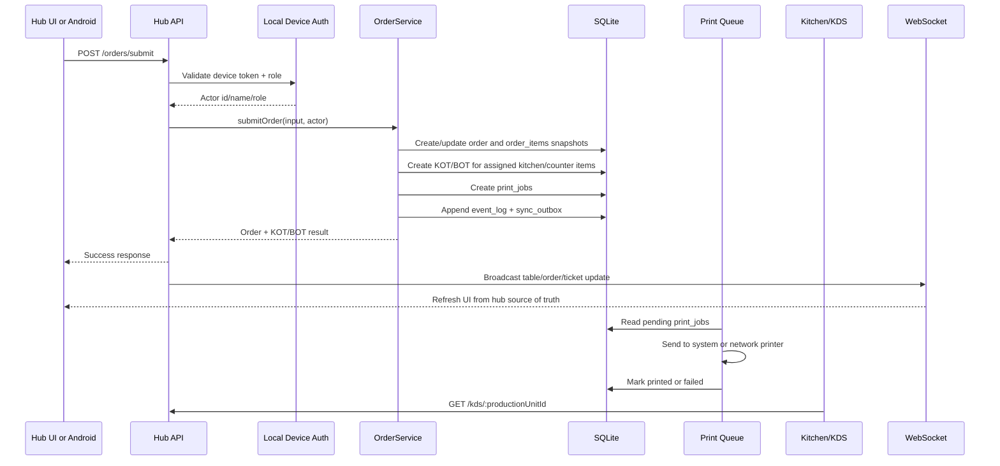

## 8. Kitchen Ready Notification Flow

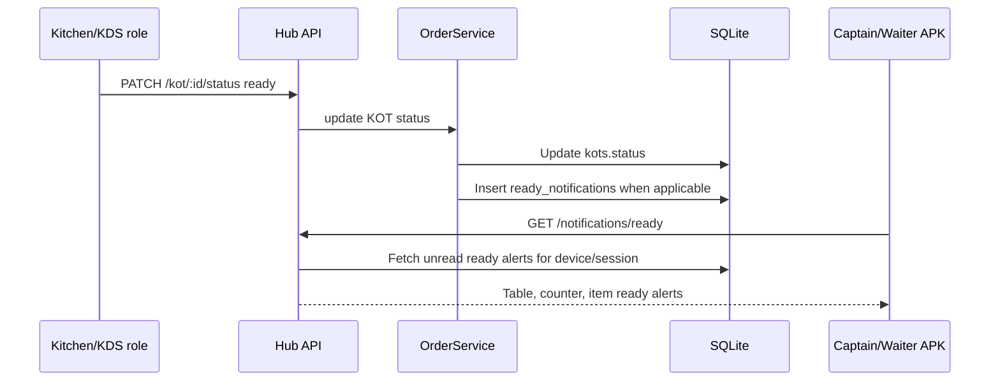

## 9. Billing And Settlement Flow

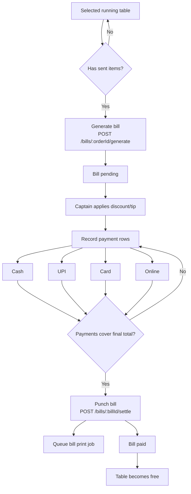

## 10. Manager Approval, Revision, And NC Flow

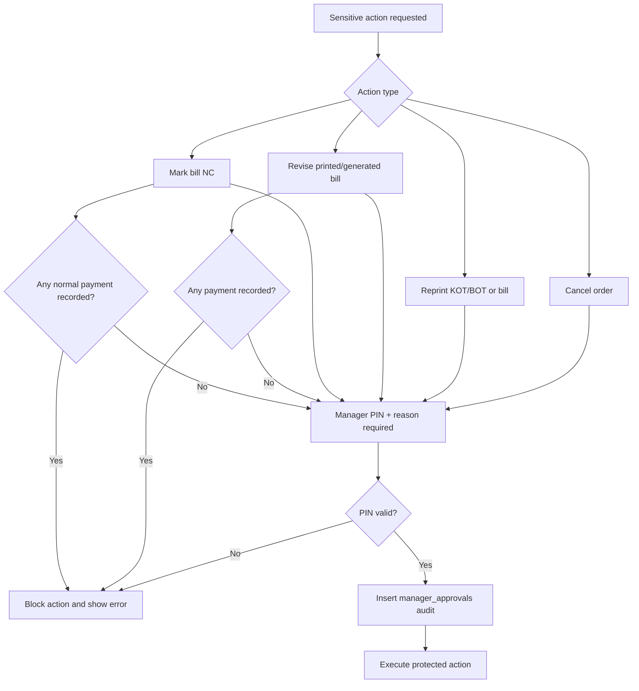

## 11. Open Item Flow

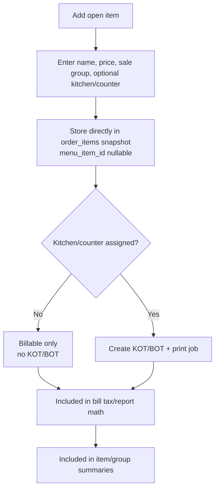

## 12. Table And Item Movement Flow

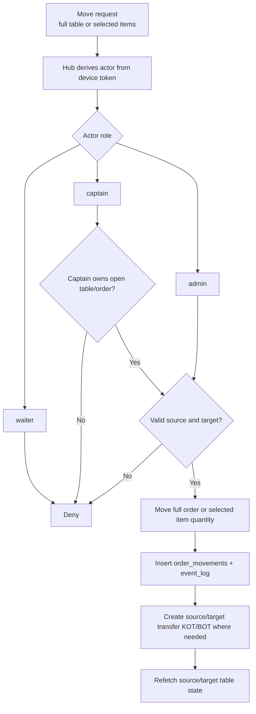

## 13. Business Day Finalization And Cloud Report Flow

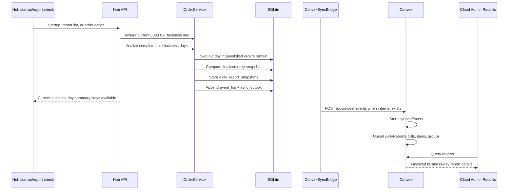

## 14. Cloud Command Pull Flow

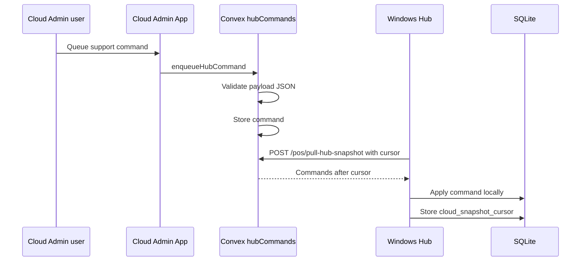

Supported command types:

- `device.revoked`
- `device.updated`
- `menu_item.upsert`
- `menu_item.disabled`
- `production_unit.upsert`
- `receipt_printer.updated`

Device commands use `hubDeviceId`.

## 15. Print Job Lifecycle

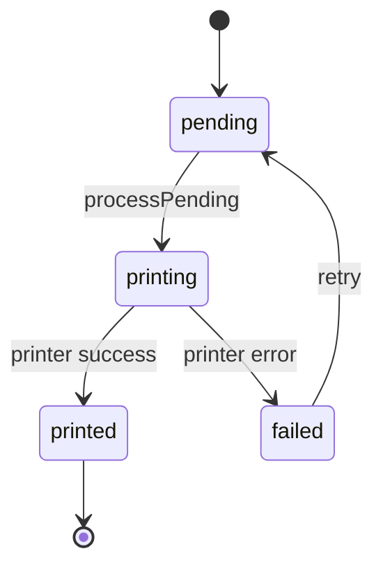

## 16. Table Display State

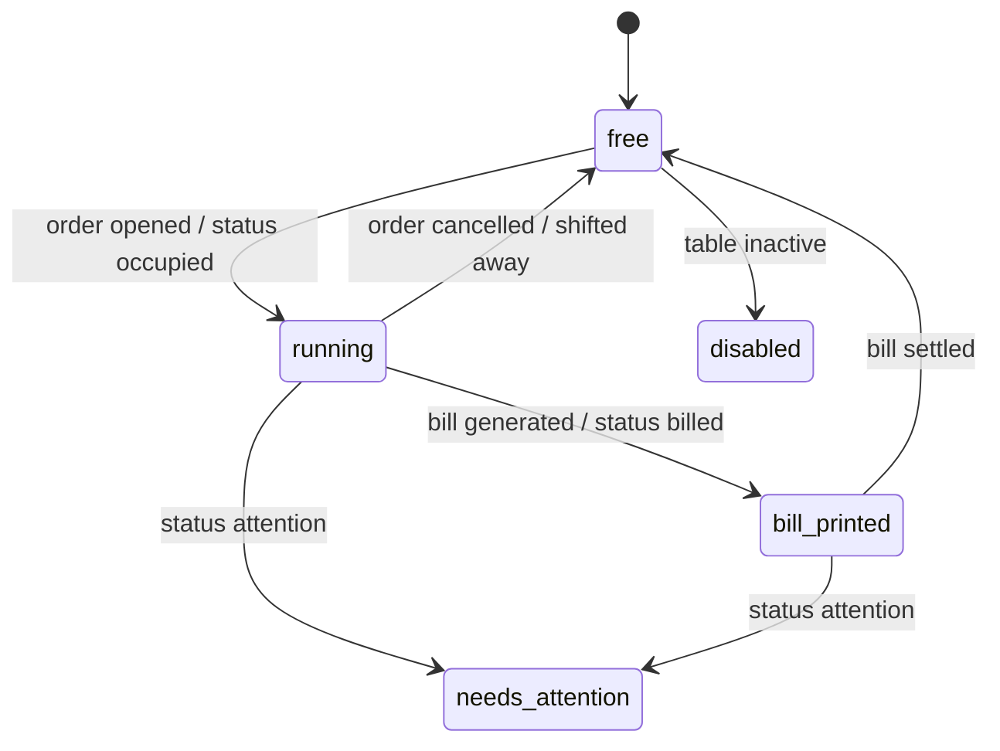

## 17. Data Ownership Summary

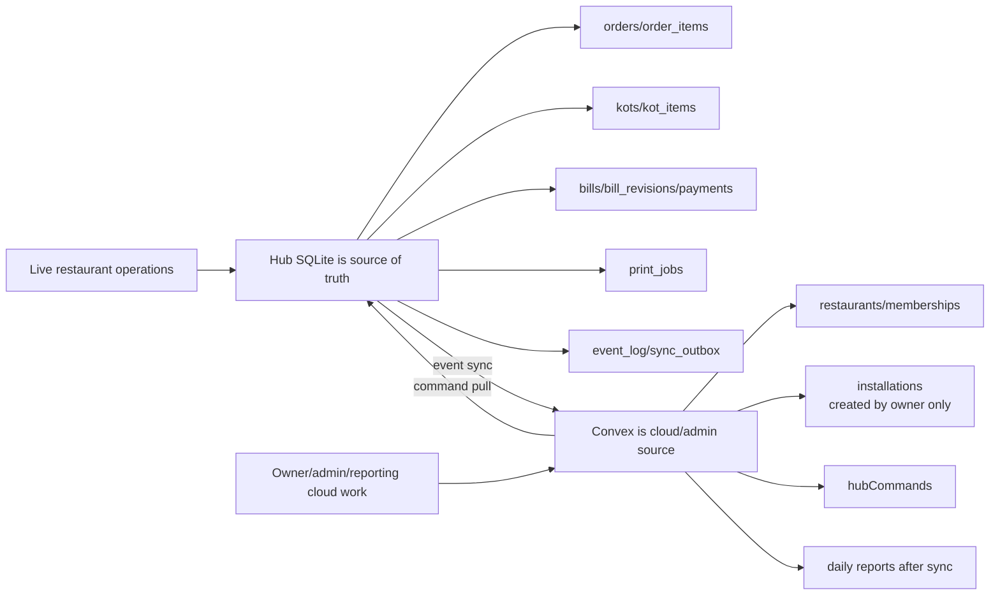
